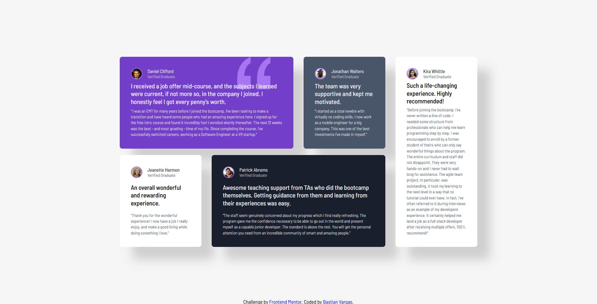

# Frontend Mentor - Social proof section solution

A responsive landing page built with semantic HTML and modern CSS architecture, following a mobile-first approach and focusing on scalability, accessibility, and clean component structure.

This is a solution to the [Social proof section challenge on Frontend Mentor](https://www.frontendmentor.io/challenges/social-proof-section-6e0qTv_bA).

### The challenge

Users should be able to:

- View the optimal layout for the section depending on their device's screen size

### Screenshot

### Links

- Solution URL: [Add solution URL here](https://your-solution-url.com)
- Live Site URL: [Add live site URL here](https://your-live-site-url.com)

### Built with

- Semantic HTML5 markup
- Flexbox
- CSS Grid
- Mobile-first workflow

## Author

- Frontend Mentor - [@Riast96](https://www.frontendmentor.io/profile/Riast96)
- Github - [@Riast96](https://github.com/Riast96)
